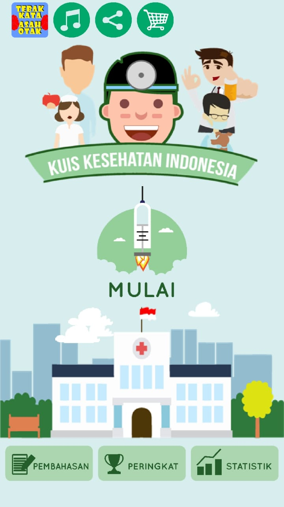

# Evaluation Of Kuis Kesehatan App
### Tampilan Utama

In the main view of the app, the start button is not that prominent, even though as the main button that connects to the main part of the app, the start button should be made in such a way as to attract the user's attention the first time user open this app. besides that in the top view, there are many buttons, they should only be placed in one place, namely "settings", so that visually, is more satisfying, and users are more comfortable using this app.

### Tampilan Kategori

in this category section, the button "search questions" has the same design as the button from the category of quiz questions, this will make the user think that the button "search questions" is part of the category.

### Tampilan Cabang Turunan

in this quiz app there are lots of categories of questions about health. but some of these categories, in which there are more categories of derivative categories. can be seen in the image above, that the derivative category view is on the right side and has the same button design as the parent category. This can confuse the user, as some users may think that the child category is actually a hidden parent category (?). otherwise a right-aligned display of child categories is not sufficient to tell that the derived category is the actual derived category.

## Activity Diagram

## Use Case Diagram

## Key Business Process

Item pada use case yang menjadi Key use casenya adalah kategori kuis, soal kuis dan pembahasan kuis. Aplikasi yang kami improve adalah sebuah aplikasi kuis, yaitu kuis tentang kesehatan. Seperti pada umumnya, yang menjadi bagian penting pada aplikasi kuis adalah hal hal yang berkaitan dengan soal dan jawabn dari kuis yang disediakan. 
Kategori menjadi key use case karena pada bidang kesehatan, banyak sekali cabang ilmu, sehingga kategori kuis menjadi hal yang penting agar informasi yang disampaikan ke user dapat tersampaikan dengan baik dan terstruktur. Selain itu, userpun akan dengan mudah mengetahui mana soal yang ingin dia kerjakan karna adanya kategori kuis.
Soal kuis tentu aja menjadi key use case karna memang tujuan utama pada aplikasi ini adalah untuk user yang ingin menguji pengetahuannya di bidang kesehatan. Sehingga soal kuis merupakan hal utama yang user tuju.
Pembahasan kuis pun menjadi kategori dalam key use case karena user mendownload aplikais ini di google play store, tidak hanya untuk menguji pengetahuannya saja, tetapi juga untuk menfaptkan informasi yang sekiranya belum user ketahui. Maka pembahasan merupakan hal kedua yang user tuju dalam mendownload aplikasi ini.

