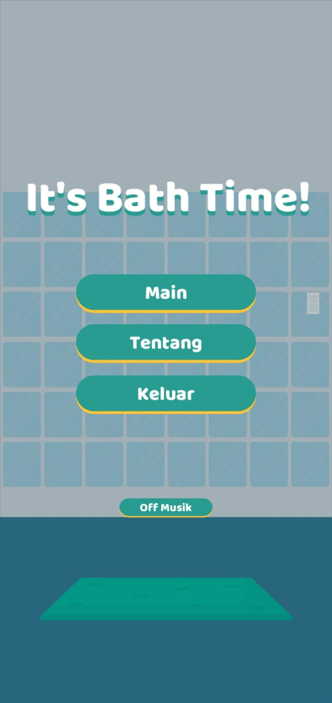
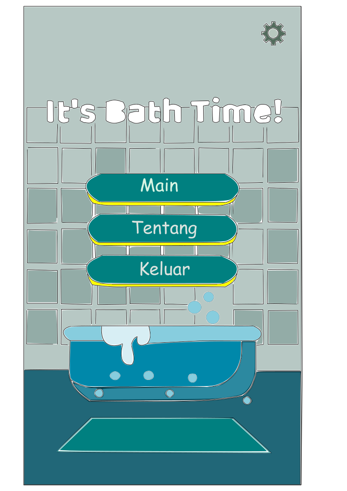

# Hasil Wawancara Application Developer : Abimanyu Darmawan

## 1.	Abimanyu bekerja sebagai apa?

Jawab : Kebetulan sekarang berada di bagian developer.

## 2.	Apa bedanya UX designer dengan developer?

Jawab : Sebenarnya kalau UI/UX itu pasti bakal ada di developer, setiap web developer atau apps developer pasti ada UI/UX-nya.

## 3.	Sudah berapa tahun  berpengalaman di bidang UX/UI designer?

Jawab : Sudah sejak 2017.

## 4.	Sekarang bekerja dimana?

Jawab : Kebetulan bekerja di Dayana Incorporate, yang merupakan semacam grup dan mempunyai anak perusahaan yang berbeda-beda bidangnya, yaitu photography, social management, crafting, dan IT. Lebih ke IT, dan untuk sekarang fokusnya ke website.

## 5.	Filosofi dari design item yang sudah diberikan kepada tim kami

Jawab : Design item tersebut dibuat sudah dari 2018, dan design tersebut merupakan design game. Lalu untuk filosofinya lebih fokus ke warna, karena gamenya ditujukan untuk anak-anak maka dipilih warna yang lebih cheerful dan fun. 

## 6.	Kesulitan apa yang dihadapi saat menjadi UI/UX designer?

Jawab : Mungkin kesulitan setiap orang berbeda-beda, maksud dari berbeda-beda itu adalah tujuan dari membuat aplikasinya. Agak tricky dalam membuat sebuah UI/UX yang affordable untuk semua kalangan, dan itu susah.

## 7.	Kira-kira sudah berapa banyak design yang dibuat, dilihat dari aplikasi yang sudah dibuat dari awal bergerak di bidang ini? 

Jawab : Kira-kira sudah puluhan, karena dari 2017 itu memang basicnya indie game developer, jadi fokusnya adalah membuat game dan dipublish juga di playstore, lalu untuk apps dan web kira-kira pada tahun 2018 sampai 2019.

## 8.	Kebiasaan Abimanyu untuk mempertimbangkan controll design?

Jawab : Kalau dari perspektif game, dulu pernah belajar game itu dibuat untuk siapa, kalau saya lebih banyaknya untuk edukasi dan interaksinya seperti kuis dan animasi.

## 9.	Dalam mempelajari UX/UI design secara otodidak atau bagaimana?

Jawab : Basicnya dulu ada, setelah tertarik lalu ikut dicoding, tetapi di dicoding, materi UX/UI itu hanya sebagian kecil dan lebih ke developnya. Selebihnya otodidak.

## 10.	Biasanya menggunakan aplikasi apa saat membuat design?

Jawab : Kalau untuk game yang lebih mentah, pakai Adobe Illustrator. Kalau aplikasi lebih banyak pakai Adobe Xd.

## 11.	Pengertian UX menurut pribadi Abimanyu?

Jawab : Menurut Abimanyu, UI lebih ke interface atau tampilan, tapi kalau UX lebih seperti scene flow atau Uxflow dan lebih ke experience penggunanya.

## 12.	Perbedaan yang mencolok dari UI designer dan UX designer

Jawab : Mungkin dari segi eksekusinya. Kalau UX lebih ke wireframe dulu, jadi si konstruksi apps atau gamenya dibuat terlebih dahulu di Uxflownya. Kalau UI condong ke meneruskan UX yang sudah dibuat tadi.

## 13.	Prinsip apa yang dipegang dalam membuat UX/UI design?

Jawab : Prinsip yang Abimanyu pegang adalah prinsip simple, si antarmuka lebih simple untuk semua umur.

## 14.	Bagaimana caranya membuat design tersebut menjadi lebih simpel?

Jawab : Diperhatikan dari warnanya, warna yang tidak terlalu ramai. Misalnya hanya memakai dua warna.

## 15.	Aplikasi yang mudah digunakan untuk pemula?

Jawab : Adobe illustrator mudah digunakan, dan ada juga beberapa misalnya figma yang didalamnya sudah ada shape-shape tertentu. Kalau adobe illustrator lebih luas.

## 16.	Kembali ke prinsip, menurut Abimanyu adakah prinsip general yang harus dipegang oleh semua UX/UI designer?

Jawab : Menurut Abimanyu,UX lebih fokus ke experiencenya. Jadi tidak hanya tampilan saja, user bisa mendapatkan kemudahan dari penggunaan aplikasinya. Lalu ada tambahan prinsip untuk design, yaitu konsistensi, kalau berada di scene pertama atau homepage warnanya misal merah dan biru, maka scene selanjutnya juga ada warna merah dan biru agar lebih konsisten dan tidak berubah-ubah. Membuat pengguna lebih nyaman dan tidak pusing, apalagi penggunanya banyak orang tua yang mungkin satu sampai dua menit mereka sudah keluar dari aplikasi.

# Link Wawancara Abimanyu Darmawan (Apps Developer)
 https://youtu.be/8sxIWuGcw0w

 # IMPROVEMENT

Abimanyu memberikan design itemnya kepada kami yang berjudul it's bath time, yang merupakan tampillan depan dari sebuah game yang bertujuan untuk memberikan edukasi tentang mandi kepada anak-anak.

*before*

lalu kami membuat improvisasi dari design item tersebut menjadi sebagai berikut :

*after*

## Analisis Improvisasi dari Design Item milik Abimanyu Darmawan

Kelompok kami mengimprove design item milik Abimanyu berupa menambahkan roda gerigi kecil sebagai simbol untuk menu setting yang didalamnya pengguna dapat mengatur on dan off musik pada game tersebut, maka dari itu kami menghilangkan menu on dan off musik, sehingga tampilan aplikasi menjadi lebih efisien. Roda gigi sudah menjadi metafora untuk simbol pengaturan atau untuk mewakili pekerjaan atau kemajuan.

Lalu kami juga menambahkan gambar bathub, alasannya agar pengguna aplikasi dapat memiliki pengalaman yang menyenangkan dan pengguna lebih mudah mengidentifikasi bahwa game tersebut adalah game yang berhubungan dengan kegiatan mandi. Kemudian kami juga mengubah sebagian warna keramik pada dinding kamar mandi tersebut untuk memberikan kesan estetik dan tidak monoton. Apalagi aplikasi tersebut merupakan game yang tujuannya dibuat untuk anak-anak. Kami berharap anak-anak dapat enjoy pada saat menggunakan aplikasi tersebut.
