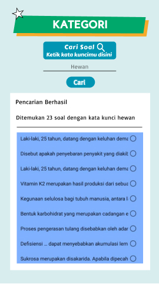

#  Report Sprint Design Process

## Day 1 Report
https://youtu.be/KSJ_qrPHfDM

Subtitle Discussion Day-1 : https://github.com/team-M-Ilkomunj2019/HCI/blob/hw2/Task%202%20Report/Subtitle_For_The_Discussion_Video_Day1.pdf

## Day 2 Report

KUIS KESEHATAN DESIGN 1

KUIS KESEHATAN DESIGN 2

## Day 3 Report
https://youtu.be/3xkMAw1z-Gc

Subtitle Discussion Day-3 : https://github.com/team-M-Ilkomunj2019/HCI/blob/hw2/Task%202%20Report/Subtitle_for_The_Voting_Video_Day3.pdf

 We invite Arief Rahman, Muhammad Adin, and Hary Susilo as by passers because each of them is the person in charge in their respective groups to redesign or improve the application in this 2nd hci assignment. besides that they also understand about google material design.

## Day 4 Report
https://youtu.be/WcaaUwqWMKc

Subtitle Discussion Day-4 : https://github.com/team-M-Ilkomunj2019/HCI/blob/hw2/Task%202%20Report/Subtitle_for_The_Video_Discussion_with_Developer_Day-4.pdf

### Explanation Of Material Design Utilization In Chosen Design

before

 

after

On the front page, the "start" button is changed to be thicker, so that it is more visible to the user. Then the settings icon is added to enter settings menus such as sound, then market, and the share menu in the application. So that the front page is not too crowded with menu icons. And the settings menu is also made pop-up to make it more interesting

before

 

after

The next improvisation that is made is when the user types a word in the question search menu, then after clicking it will display a notification of the number of questions found in the application, then immediately followed by the appearance of the questions available in the application. it aims to make this interaction more efficient and effective.

In the question category that has sub-branches the appearance is also changed, namely the sub-branches are changed to a lighter green color than the branch button color and their position is placed in the middle so that the user can distinguish that they are sub-branches.

